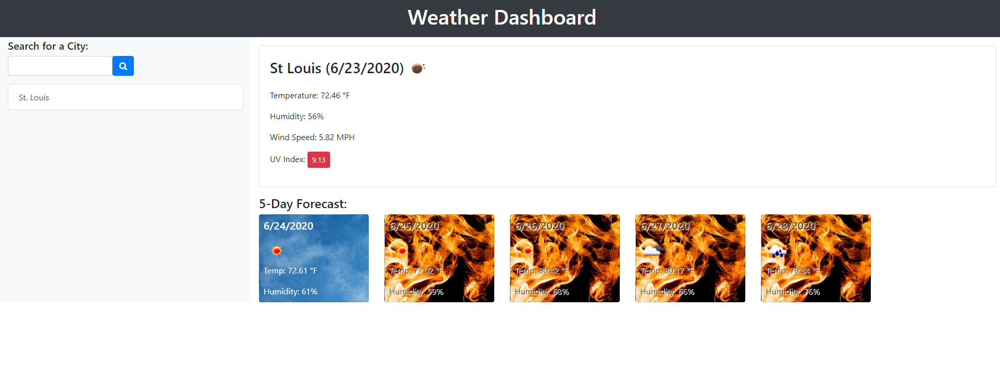

# Weather Dashboard

The application can be found here:  https://cobypear.github.io/WeatherDashboard

This web aplication uses the OpenWeatherMap API to fetch a 5 day forecast for the city entered in the searchbox.
Using local storage, the city list persists through page reload.
Here's an example of the 5 day forecast for St. Louis, MO

